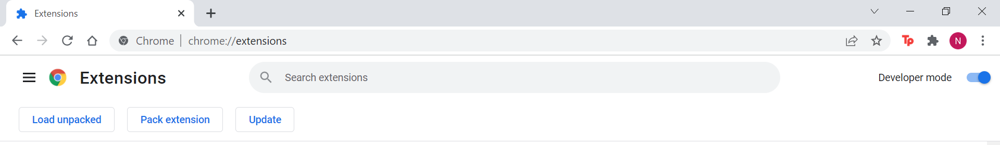
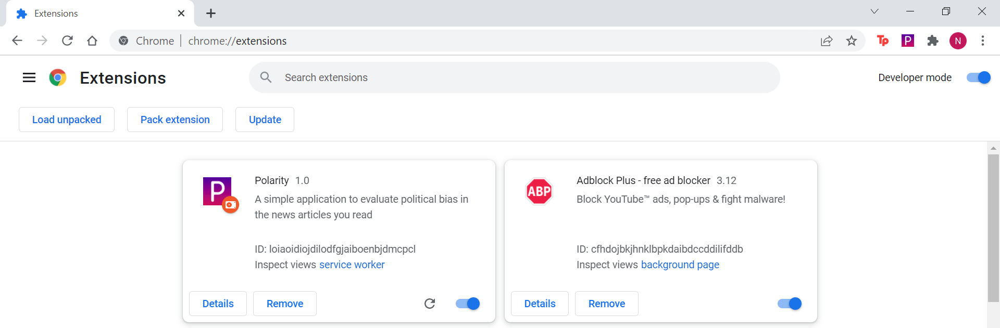

# Polarity
Please visit [our Notion](https://goofy-toast-98c.notion.site/Polarity-Political-Bias-Detection-in-News-Articles-486cf3e4c6fa43c4aa3528f07e19a86e) for a detailed report of our project.

### Installation Instructions
Unfortunately we cannot publish or even package our Chrome Extension without it being approved for publishing on the app store. To run Polarity, you'll have to download the extension code and load it into Chrome in Extention Developer Mode. Below are instructions on how to do so.

1. Download and unzip the file [polarity.zip](https://github.com/tassossapalidis/biasclassifier/blob/main/polarity.zip) to the directory of your choosing.
2. Open the chrome browser and go to chrome://extensions/
3. Toggle on "Developer Mode" in the top right.

4. Select "Load unpacked" in the top left and select the unzipped file.

5. You should see the extension appear among your other Chrome extensions as below.

6. To pin the app, navigate to the puzzle icon in the top right of the browser and select the pin icon next to Polarity.

## Repo Tour
### Extension Directory
This directory holds the code for the Chrome Extension UI. It is packaged in the [polarity.zip](https://github.com/tassossapalidis/biasclassifier/blob/main/polarity.zip) file for your use.

### Backend Directory
The following files make up the source code for our Google Cloud Function:
* [main.py](https://github.com/tassossapalidis/biasclassifier/blob/main/backend/main.py) - the main function script
* [predict.py](https://github.com/tassossapalidis/biasclassifier/blob/main/backend/predict.py) - loads models and compute predictions
* [scraper.py](https://github.com/tassossapalidis/biasclassifier/blob/main/backend/scraper.py) - code to scrape article contents from the web
* [utils.py](https://github.com/tassossapalidis/biasclassifier/blob/main/backend/utils.py) - various helper functions
* [requirements.txt](https://github.com/tassossapalidis/biasclassifier/blob/main/backend/requirements.txt) - dependencies

The [training directory](https://github.com/tassossapalidis/biasclassifier/tree/main/backend/training) contains scripts used to train the model

The [data directory](https://github.com/tassossapalidis/biasclassifier/tree/main/backend/data) contains a sample of the data we used for training. For the full training set, please download the [All The News](https://www.kaggle.com/snapcrack/all-the-news) dataset from Kaggle.
